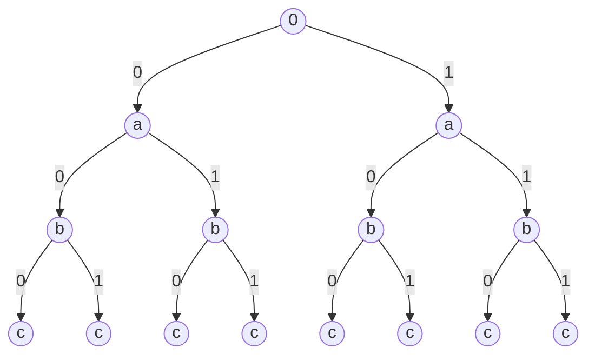
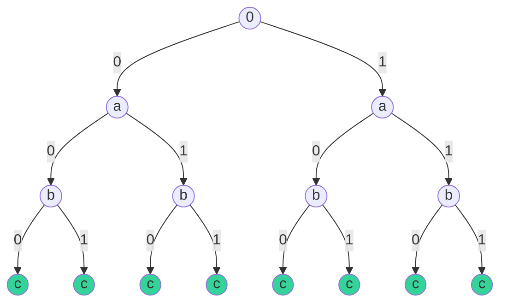

Given three elements {a,b,c}, write a recursive program to return all the combinations.

```
 , a, b, c, ab, ac, bc, abc
```
<div v-click>

For each element, we have two choices.

</div>


<div style="height:300px">


<!-- Animation 1 -->

<div v-click class='absolute diagram'>



</div>

<!-- Animation 2 -->

<div v-click class='absolute diagram'>



</div>


</div>

<div v-click>

```
000, 001, 010, 011, 100, 101, 110, 111
```


</div>

<div v-click>

We call '000' the **label** of the left most leaf.

</div>


<style>
    .diagram{
        background-color: rgba(243,232,255,1) !important;
        width:500px !important;
        left:22%;
    }

    .edgeLable{
        background-color:red;
    }

    </style>
