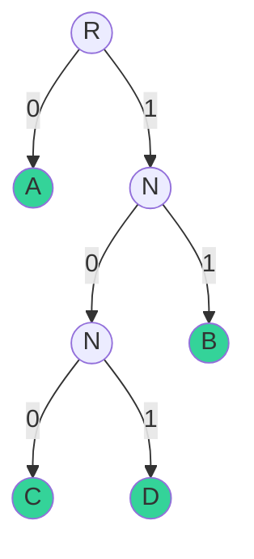
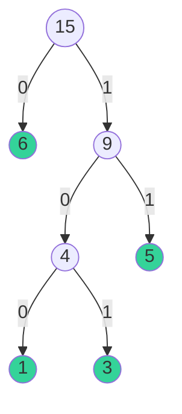

---
# try also 'default' to start simple
theme: unicorn
# random image from a curated Unsplash collection by Anthony
# like them? see https://unsplash.com/collections/94734566/slidev
background: https://source.unsplash.com/collection/94734566/1920x1080
# apply any windi css classes to the current slide
class: 'text-center'
# https://sli.dev/custom/highlighters.html
highlighter: shiki
# show line numbers in code blocks
lineNumbers: false
# some information about the slides, markdown enabled
info: |
  ## Slidev Starter Template
  Presentation slides for developers.

  Learn more at [Sli.dev](https://sli.dev)
# persist drawings in exports and build
drawings:
  persist: false
# page transition
transition: slide-left
# use UnoCSS
css: unocss
colorSchema: 'light'

---

# Huffman Codings

<!-- Presentation slides for developers -->

<!--  -->

<div class='mt-10'>
  Beilong Tang
  <br>
  Guanglei Cheng
</div>

<div class="abs-br m-6 flex gap-2">
  <!-- <button @click="$slidev.nav.openInEditor()" title="Open in Editor" class="text-xl slidev-icon-btn opacity-50 !border-none !hover:text-white">
    <carbon:edit />
  </button> -->
  <a href="https://github.com/Beilong-Tang/Huffman-Coding" target="_blank" alt="GitHub"
    class="text-xl slidev-icon-btn opacity-50 !border-none !hover:text-white">
    <carbon-logo-github />
  </a>
</div>

<!--
The last comment block of each slide will be treated as slide notes. It will be visible and editable in Presenter Mode along with the slide. [Read more in the docs](https://sli.dev/guide/syntax.html#notes)
-->

<style>
h1{
  font-size:60px !important;
  line-height: 10rem !important;
}
</style>

---
---
# Why We chose Huffman Coding?

<div class='flex'>
<div class='w-1/2-a'>
  <h2 v-click >My expectation before the course:</h2>
  <br>
  <div class='h-55 w-100 flex'>
    
    <div v-click class='w-1/2-a ml-2 text-center flex justify-center items-center'> 
        <!-- <div> -->
        
        <!-- </div> -->
    </div>
   
  </div>
</div>

<div  v-after class='w-1/2-a border-l-2 border-dashed border-black pl-4'>
  <h2 v-click >However...</h2>
  
</div>
</div>
<br>
<br>

<style>
  h1{
    line-height: 5rem !important;
  }

  h2{
    color: black !important
  }
  </style>
---
layout: table-contents
gradientColors: ['#8EC5FC', '#E0C3FC']
---

# Contents

- 📝 **Introduction** 

- 🎨 **Background** 

- 🛠   **Implementation**

- 🤹 **Application** 

<br>
<br>

<style>
.self-end{
  align-self:auto
}

li {
  font-size:20px !important;
  margin-top:10px;
}
</style>

---
layout: image-right
image: https://source.unsplash.com/collection/94734566/1920x1080layout
---

# Contents

- Introduction

- **Background**

- Implementation

- Application


<style>

    .slidev-layout.new-section{
    --un-gradient-stops:rgba(243,232,255,1) !important
  }

  h1{
    display:none;
    position:absolute;
    top: 40%;
    color: rgba(162,28,175,1)
  }

  div[data-v-afb4231e]{
    background-color:rgba(243,232,255,1) !important
  }

  ul{
    margin-top:-20px;
    font-size:25px !important ;
    position:absolute !important;
    top:40% !important;
    margin-left:20px
  }

</style>


---
layout: intro
introImage: 'https://www1.ucsc.edu/currents/99-00/art/huffman_david.99-10-11.jpg'
---

# David A. Huffman
<br>


<div>

<div v-click>

David Albert Huffman (August 9, 1925 – October 7, 1999) was an American pioneer in computer science, known for his Huffman coding. Huffman is best known for Huffman coding, which he published while a ScD student at MIT in 1952.[^1]

</div>

<div v-click>

Huffman Coding was invented when he was having a final exam to find the most efficient binary code, where Huffman was not satisfied by any of them. he hit upon the idea of using a frequency-sorted binary tree and quickly proved this method the most efficient.[^2]

[^1]: [David A. Huffman](https://en.wikipedia.org/wiki/David_A._Huffman)
[^2]: [Huffman coding](https://en.wikipedia.org/wiki/David_A._Huffman)

</div>

</div>

<style>
.footnotes-sep {
  @apply mt-20 opacity-10;
}
.footnotes {
  margin-top:-40px !important;
  font-size:0.01px !important;
  @apply text-sm opacity-75;
}
.footnote-backref {
  display: none;
}
</style>

---

# Huffman Coding

<div v-click class='ft-18'>

Briefly Speaking, in computer science and information theory, a **Huffman code** is a particular type of optimal **prefix code** that is commonly used for **lossless data compression**. It is variable length coding (VLC).

</div>

<div v-click class='ft-18'>

**Let us think about how to Strings are represented in computer**

</div>

<div class='flex'>

<div class= 'w-1/2-a ft-18' v-click>

What we saw:

```python
A
B
C
D
```

</div>

<div class='w-1/2-a ml-2 ft-18' v-click>

What is behind:

```python
01000001 # ASCII Code for A
01000010 # ASCII Code for B
01000011 # ASCII Code for C
01000100 # ASCII Code for D
```

</div>

</div>


<div v-click class=''>

<p>

**Everything is binary.**

</p>

</div>

<style>

code{
  font-size:16px
}
  </style>


---

# Simple Question

<div class='ft-18'>

Image we have a String 

```python
BCAADDDCCACACAC # 15 characters in total
```
<br>

<p v-click> 

How many bits do we need to store them?  _(remind that 1 character takes 8 bits)_ 

</p>

<p class='' v-click >

$15 \times 8=120 \text{ bits}$

</p>

<br>

<h2 v-click>
Using Haffman Coding, we only need <span class='color-red-5'> 75 </span> bits to save it!
</h2>

</div>


<style> 
  code {
    font-size:16px;
  }

  h2{
    line-height:5rem !important;
  }
</style>

---
src: ./pages/content_2.md
---

---
preload: false
---

# Prefix Problem

You have a String 'BCAADDDCCACACAC'. How can you represent it?

<div v-click>

Since we only have 4 characters here, 2 bits will do the job.

|  Character   |  Bit   |
| --- | --- |
| A | 00 |
| B | 01 |
| C | 10 |
| D | 11 |

In total, we will use $2 \times 15 \text{ (total bit number of String)} + (8+2) \times 4 \text{ (the above table)} = 70$ bits

</div>

<style>
  table {
    width:50% !important
  }
  </style>

---

Can we represent the String 'BCAADDDCCACACAC' with even less bits? 

<div v-click>

We calculated the frequency of each character:

|  Character   |  Frequency   | Bits  |
| --- | --- | ---|
| A | 5 | 1 |
| B | 1 | 01 |
| C | 6 | 0 |
| D | 3 | 00|

</div>

<div v-click >

In total, we will use $2 \times 15 \text{ (total bit number of String)} + (8 \times 4 + 1 + 2 + 1 + 2) \text{ (the above table)} = 68$ bits

</div>

<div v-click>

Higher Frequency -> Lower Bits. This is a variable length coding (VLC).

</div>


<style>
  table {
    width:50% !important
  }
  </style>

---

# Prefix Issues Here

|  Character   |  Frequency   | Bits  |
| --- | --- | ---|
| A | 5 | 1 |
| B | 1 | 01 |
| C | 6 | 0 |
| D | 3 | 00|

<div v-click >

What is the corresponding String it represents?

```
00101000
```

</div>

<br>

<div v-click >

It is impossible to tell since the bit of C is the **prefix** for bit of B and D.

</div>

<div v-click > 

Any representation bits cannot be the prefix of another representation bits.

</div>

<style>
  table {
    margin-top:10px;
    width:50% !important;
    position:relative;
    margin-top:-25px
  }
  </style>

---

# Binary Tree

**Review**

- A graph 𝑇 is a tree if and only if between every pair of distinct vertices of 𝑇 there is a unique path.

- A rooted tree is a tree in which one vertex is designated as the root. In a rooted tree, among two adjacent vertices, the one closer to the root is called the parent, the other is called the child.

<div v-click>

A rooted tree where each node has at most two children is called a **binary tree**.

</div>

<div class='flex' v-click>

<div class='ml-40 h-400 w-50'>

</div>

<div class='ml-20 h-400 w-50'>

</div>

</div>
---
src: ./pages/combination_tree.md
---

---

# Labelled Binary Tree

For any binary tree with left child labelled 1 and right child labelled 0, the label of the leaf will not be any prefix of another label of the leaf.


<div class='flex'>

<div class='w-1/3-a ml-10' v-click>



</div>

<div class='w-2/3-a'>

<div v-click >

|  Character   | Bits  |
| --- | ---|
| A |  0 |
| B |  1 |
| C |  100 |
| D |  101 |

</div>

<div v-click>

Huffman Coding: Higher Frequency => Fewer Bits => Larger Distance

</div>

</div>


</div>

---
src: ./pages/Implementation.md
---

---

## Step 1. Calculate the frequency of each Character

<br>

Suppose we have String:

```
BCAADDDCCACACAC
```

<br>

First, we iterate the String and calculate the frequency of each character:

<div v-click>

|  Character   |  Frequency   |
| --- | --- |
| A | 5 | 
| B | 1 | 
| C | 6 | 
| D | 3 | 

</div>

---

## Step 2. Sort the String according to its frequency

<div class='flex'>

<div class='w-1/3-a ml-10'>

|  Character   |  Frequency   |
| --- | --- |
| A | 5 | 
| B | 1 | 
| C | 6 | 
| D | 3 | 

</div>


<div class='w-1/2-a flex justify-center items-center' v-click>


|  B  |  D  |  A  |  C  |
| --- | --- | --- | --- |
|  1  |  3  |  5  |  6  |


</div>


</div>

<style>

  table {
    margin-top:20px;
    border: 1px solid black;
    font-size:14px;
    width:40% !important;
  }

  th {
    background-color:#60a5fa;
    border: 1px solid black;
  }

  td{
    border: 1px solid black;
  }

  </style>

---
src: ./pages/huffman_tree.md
---

---

# 4. Find binary representation for each character

<div class='flex'>

<div class='w-1/3-a ml-10'>



</div>

<div class ='w-1/3-a flex justify-center items-center' v-click>

|  Character   |  Frequency   | Bits  |
| --- | --- | ---|
| A | 5 | 11 |
| B | 1 | 100 |
| C | 6 | 0 |
| D | 3 | 101|

</div>

</div>


<div v-click>

```bash
10000100100001101000001010000010100010001000100010001000100001101000011010000010100001101000001010000110100000101000011 # 120

1000111110110110100110110110 # 28
```

</div>

<style>

table {
    border: 1px solid black;
    font-size:14px;
    width:40% !important;
  }

  th {
    background-color:#60a5fa;
    border: 1px solid black;
  }

  td{
    border: 1px solid black;
  }

  </style>


---

# 5. Determine the final number of bits

<div v-click>

Wee need to send:
- the coded string
- the information needed to construct a huffman tree

</div>

<div v-click class='w-200'>

|  Character   |  Frequency   | Bits  | Total Bits |
| --- | --- | ---| ---|
| A | 5 | 11 | $5 \times 2 = 10$ |
| B | 1 | 100 | $1 \times 3 = 3$ |
| C | 6 | 0 | $6 \times 1 = 6$ |
| D | 3 | 101| $3 \times 3 = 9$ |
| $8 \times 4 = 32$ bits | $5 + 1 + 6 + 3 = 15$ bits |            |$10 + 3 + 6 + 9 = 28$ bits|

</div>

<br>

<div v-click>

$32 + 15 + 28 = 75$ bits

</div>

<style>
  table{
    font-size:12px;
  }

  </style>

---
src: ./pages/application.md
---

---

# Application

<div v-click='1'>

- JPEG

</div>
<br>

<div v-click='2'>

- MP3

</div>
<br>

<div v-click='3'>

- Zip File (PKZIP)

</div>

<br>

<div class='flex h-50'>

<div class='h-50 w-50 zip' v-click='1'  >


</div>


<div class='h-50 w-50 mp3 ml-25' v-click='2'  >


</div>


<div class='h-50 w-50 jpeg ml-25' v-click='3' >


</div>

</div>

<style>

  .zip{
    left:750px;
    top:150px;
  }

  .mp3{
    left:550px;
    top:150px;
  }

  .jpeg{
    left:300px;
    top:150px;
  }

  h1{

  }

  </style>


---
layout: center
---

# Thank you

---

## References

<br>

https://en.wikipedia.org/wiki/Huffman_coding

https://en.wikipedia.org/wiki/David_A._Huffman

https://blog.csdn.net/qq_19887221/article/details/125322754

https://www.youtube.com/watch?v=hpdcWwkRD5c

